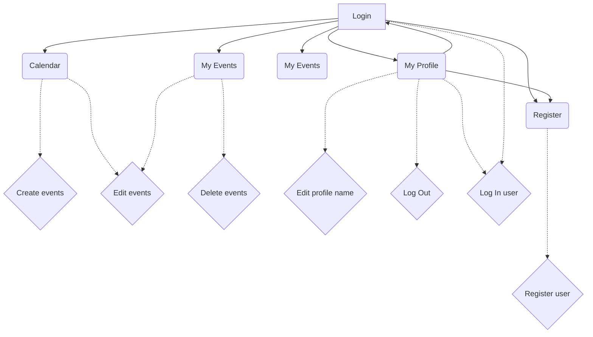

# Flutter Exam - Calendar application

A simple and functional calendar mobile app using Flutter and Dart, with basic authentication and event management. Users can log in, create/edit/delete events, and view their schedule in various formats.


## Deployment

To deploy this project:

**IMPORTANT:** This project is written for Android only, using a Windows development environment.
1. Install Flutter
2. Install Firebase
3. Install VSCode (optional)
4. Install Android SDK

Then, open the root directory of the project and run these commands:
```
  flutter pub get
  flutter run
```


## Flow chart


